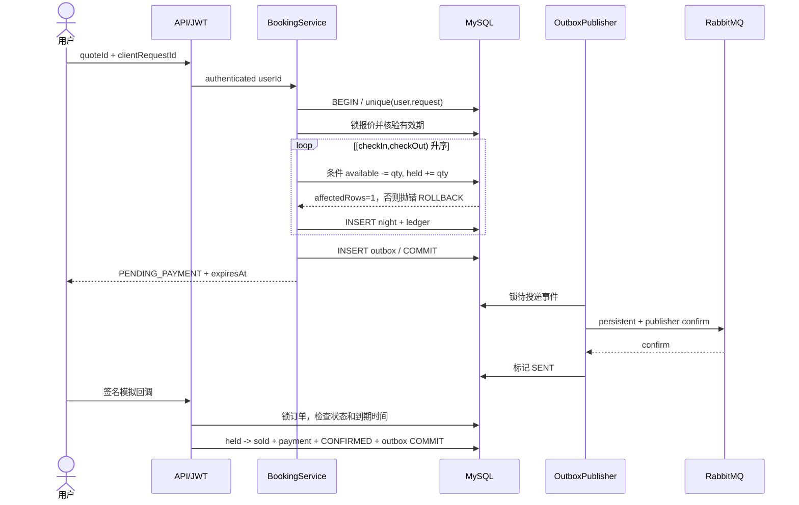
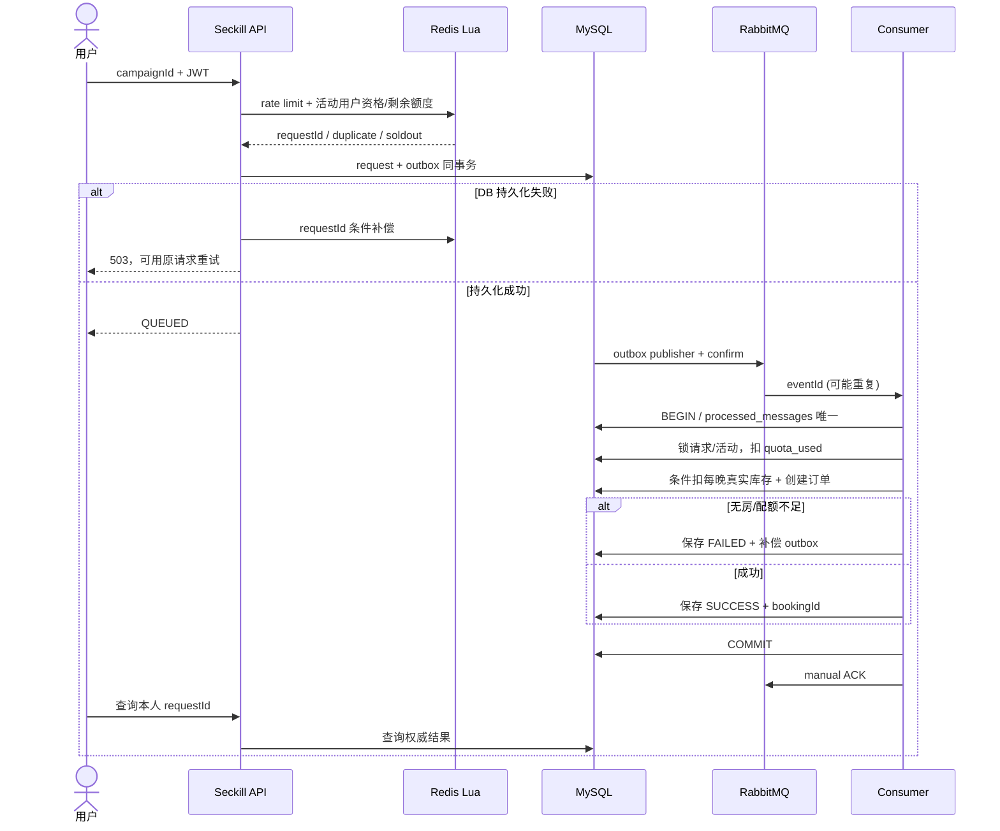

# 普通预订和秒杀时序图

```mermaid
sequenceDiagram
 actor U as 用户
 participant API as API/JWT
 participant B as BookingService
 participant DB as MySQL
 participant O as OutboxPublisher
 participant MQ as RabbitMQ
 U->>API: quoteId + clientRequestId
 API->>B: authenticated userId
 B->>DB: BEGIN / unique(user,request)
 B->>DB: 锁报价并核验有效期
 loop [checkIn,checkOut) 升序
 B->>DB: 条件 available -= qty, held += qty
 DB-->>B: affectedRows=1，否则抛错 ROLLBACK
 B->>DB: INSERT night + ledger
 end
 B->>DB: INSERT outbox / COMMIT
 B-->>U: PENDING_PAYMENT + expiresAt
 O->>DB: 锁待投递事件
 O->>MQ: persistent + publisher confirm
 MQ-->>O: confirm
 O->>DB: 标记 SENT
 U->>API: 签名模拟回调
 API->>DB: 锁订单，检查状态和到期时间
 API->>DB: held -> sold + payment + CONFIRMED + outbox COMMIT
```

```mermaid
sequenceDiagram
 actor U as 用户
 participant A as Seckill API
 participant R as Redis Lua
 participant D as MySQL
 participant Q as RabbitMQ
 participant W as Consumer
 U->>A: campaignId + JWT
 A->>R: rate limit + 活动用户资格/剩余额度
 R-->>A: requestId / duplicate / soldout
 A->>D: request + outbox 同事务
 alt DB 持久化失败
 A->>R: requestId 条件补偿
 A-->>U: 503，可用原请求重试
 else 持久化成功
 A-->>U: QUEUED
 D->>Q: outbox publisher + confirm
 Q->>W: eventId (可能重复)
 W->>D: BEGIN / processed_messages 唯一
 W->>D: 锁请求/活动，扣 quota_used
 W->>D: 条件扣每晚真实库存 + 创建订单
 alt 无房/配额不足
 W->>D: 保存 FAILED + 补偿 outbox
 else 成功
 W->>D: 保存 SUCCESS + bookingId
 end
 W->>D: COMMIT
 W->>Q: manual ACK
 U->>A: 查询本人 requestId
 A->>D: 查询权威结果
 end
```
